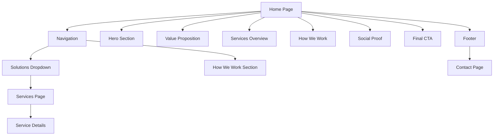

# VirtueNex Automation - Website Architecture & Design Plan

## 🎯 Project Overview

**Brand**: VirtueNex Automation  
**Type**: AI Automation Business Website  
**Style**: Minimalistic, Techy, High-Converting  
**Color Scheme**: Black background, White text  
**Tech Stack**: TypeScript + Vite + Vanilla CSS

---

## 📐 Site Architecture



---

## 🗂️ Project Structure

```
virtuenex-automation/
├── public/
│   ├── favicon.ico
│   └── og-image.png
├── src/
│   ├── pages/
│   │   ├── index.html          # Home page
│   │   ├── services.html       # Services page
│   │   └── contact.html        # Contact page
│   ├── styles/
│   │   ├── reset.css           # CSS reset
│   │   ├── variables.css       # CSS custom properties
│   │   ├── global.css          # Global styles
│   │   ├── components.css      # Reusable components
│   │   └── animations.css      # Keyframes & transitions
│   ├── scripts/
│   │   ├── main.ts             # Main entry point
│   │   ├── navigation.ts       # Navigation logic
│   │   ├── animations.ts       # Scroll animations
│   │   └── contact-form.ts     # Form handling
│   └── components/
│       ├── nav.html            # Navigation component
│       └── footer.html         # Footer component
├── package.json
├── tsconfig.json
├── vite.config.ts
└── README.md
```

---

## 🎨 Design System

### Color Palette
- **Background**: `#000000` (Pure Black)
- **Text Primary**: `#FFFFFF` (White)
- **Text Secondary**: `#A0A0A0` (Gray)
- **Accent**: `#FFFFFF` with opacity variations
- **Borders**: `rgba(255, 255, 255, 0.1)`

### Typography
- **Font Family**: Inter, SF Pro Display, or System Font Stack
- **Headings**: 
  - H1: 3.5rem (56px) - Hero
  - H2: 2.5rem (40px) - Section Titles
  - H3: 1.75rem (28px) - Service Cards
- **Body**: 1rem (16px) - Line height 1.6
- **Weight**: 400 (Regular), 600 (Semibold), 700 (Bold)

### Spacing System
- Base unit: 8px
- Scale: 8, 16, 24, 32, 48, 64, 96, 128px

### Components
- **Buttons**: 
  - Primary: White text on transparent with white border, hover fills white
  - Ghost: White text with subtle hover
- **Cards**: Dark background with subtle border, hover effect
- **Inputs**: Dark with white border, focus state

---

## 📄 Page Structure

### 1. Home Page (`index.html`)

#### Section 1: Hero
**Purpose**: Immediate impact and clear value proposition

**Copy Direction**:
- Headline: Bold statement about AI transformation
- Subheadline: Specific outcome (revenue/efficiency/scale)
- CTA: "Get Started"

**Visual Elements**:
- Animated grid background
- Glowing cursor effect
- Subtle particle system

#### Section 2: Value Proposition
**Purpose**: Build credibility and address pain points

**Copy Direction**:
- 3-4 key statistics or outcomes
- Problem → Solution framework
- Trust indicators

#### Section 3: Services Overview
**Purpose**: Introduce the 4 service categories

**Layout**: 2x2 Grid (Desktop), Stack (Mobile)

**Categories**:
1. **Digital Platforms** - Build
   - Tagline: "The infrastructure your business runs on"
   - Icon: Building blocks/Foundation
   
2. **Growth & Revenue** - Scale  
   - Tagline: "Systems that find customers and close deals"
   - Icon: Graph/Growth arrow
   
3. **Operations & Efficiency** - Run
   - Tagline: "Remove bottlenecks slowing down your team"
   - Icon: Gears/Automation
   
4. **Strategy & Custom** - Evolve
   - Tagline: "High-level engineering and training"
   - Icon: Brain/Strategy

**CTA**: "Get Started" (links to contact)

#### Section 4: How We Work
**Purpose**: Build confidence in the process

**Layout**: Timeline or Step-by-step

**Process Steps** (Suggested):
1. **Discovery Call** - Understand your business and goals
2. **Strategy Design** - Custom AI automation blueprint  
3. **Build & Deploy** - Implement solutions with your team
4. **Scale & Optimize** - Continuous improvement and support

**CTA**: "Get Started"

#### Section 5: Social Proof (Optional but Recommended)
**Purpose**: Validate with results

**Content Ideas**:
- Client results (if available)
- Key metrics (ROI, time saved, revenue increased)
- Industries served
- Technologies used

**CTA**: "Get Started"

#### Section 6: Final CTA
**Purpose**: Last chance conversion

**Copy Direction**:
- Urgency or transformation focused
- Clear next step
- Remove friction

**CTA**: "Get Started"

#### Section 7: Footer
**Content**:
- Logo/Brand name
- Quick links (Home, Services, Contact)
- Contact CTA button
- Social links (if applicable)
- Copyright

---

### 2. Services Page (`services.html`)

**Structure**: Detailed view of all services organized by category

**Layout**:
- Hero section with page title
- 4 category sections (expandable or accordion-style)
- Each service as a card with:
  - Service name
  - Description (2-3 sentences)
  - Key benefits (3-4 bullet points)
  - Use cases
- Bottom CTA section

**Services by Category**:

#### Category 1: Digital Platforms (Build)
1. **Conversion Systems**
   - Websites engineered to convert visitors into buyers
   
2. **Mobile App Development**
   - Native iOS and Android apps for your product
   
3. **Custom Web Platforms**
   - Scalable SaaS dashboards and internal tools

#### Category 2: Growth & Revenue (Scale)
1. **A.I. Sales Systems**
   - Closes leads for you 24/7 without human input
   
2. **AI Lead Generation**
   - Fills your pipeline. Filters buyers automatically
   
3. **Social Media Automation**
   - Posts. Replies. Closes deals in DMs
   
4. **Call Automation**
   - Answers, follows up, and closes calls instantly
   
5. **Content Creation**
   - Automated content engines for blogs and social

#### Category 3: Operations & Efficiency (Run)
1. **Support Automation**
   - Instant support, without the overhead
   
2. **Hiring Systems**
   - Finds top talent, not just applicants
   
3. **Project Management**
   - Makes your team execute tasks on time
   
4. **AI Analytics System**
   - See the future of your business with predictive data

#### Category 4: Strategy & Custom (Evolve)
1. **Custom Solutions**
   - Your unique challenges, our tailored AI models
   
2. **AI Academy**
   - Empowering your team for the AI era

**CTA**: "Get Started" (throughout and at bottom)

---

### 3. Contact Page (`contact.html`)

**Layout**: Centered form with sidebar

**Form Fields**:
- Name (required)
- Email (required)
- Company (optional)
- Phone (optional)
- Service Interest (dropdown - multi-select)
- Message/Project Details (textarea, required)
- Submit button

**Sidebar Content**:
- Brief text about next steps
- Response time expectation
- Alternative contact methods (email, phone)

**Validation**:
- Client-side TypeScript validation
- Clear error messages
- Success state after submission

---

## ✨ Technical Features

### Performance
- Lazy loading for images
- Code splitting
- Minimal dependencies
- Optimized assets
- Fast page transitions

### Animations
- Scroll-triggered fade-ins
- Parallax effects (subtle)
- Hover states on interactive elements
- Smooth scrolling between sections
- Loading states

### Accessibility
- Semantic HTML
- ARIA labels
- Keyboard navigation
- Focus states
- Alt text for images
- Color contrast ratios (white on black = excellent)

### SEO
- Meta tags (title, description)
- Open Graph tags
- Structured data (JSON-LD)
- Sitemap
- Robots.txt

---

## 🎯 Copy Guidelines

### Tone of Voice
- **Confident**: You know what you're doing
- **Direct**: No fluff, straight to value
- **Technical but accessible**: Smart without being alienating
- **Result-focused**: Talk outcomes, not features

### Messaging Hierarchy
1. **Primary**: AI automation that drives revenue
2. **Secondary**: Remove bottlenecks, scale faster
3. **Supporting**: Custom solutions, expert team

### Power Words to Use
- Automate, Scale, Convert, Close, Generate
- Predictive, Intelligent, Custom, Tailored
- 24/7, Instant, Automatic, Effortless
- Revenue, Growth, ROI, Results

### Words to Avoid
- Maybe, possibly, might
- Complicated, complex (in a negative way)
- Cheap, affordable (positions low value)
- Revolutionary, game-changing (overused)

---

## 🚀 Development Approach

### Phase 1: Foundation
- Set up Vite + TypeScript project
- Configure build tools
- Create design system (CSS variables)
- Build component structure

### Phase 2: Core Pages
- Build Home page sections
- Create reusable components
- Implement navigation
- Add responsive design

### Phase 3: Secondary Pages
- Services page with detailed cards
- Contact page with form
- Form validation logic

### Phase 4: Enhancement
- Scroll animations
- Micro-interactions
- Performance optimization
- Cross-browser testing

### Phase 5: Polish
- SEO implementation
- Final QA
- Performance audit
- Deploy preparation

---

## 📊 Success Metrics

### Technical
- Lighthouse score: 90+ across all categories
- First Contentful Paint: < 1.5s
- Time to Interactive: < 3s
- Mobile-friendly test: Pass

### Business
- Clear CTAs on every section
- Easy navigation to contact
- Service clarity and differentiation
- Professional, trustworthy appearance

---

## 🔧 Tech Stack Details

### Core
- **TypeScript**: Type-safe JavaScript
- **Vite**: Fast build tool and dev server
- **Vanilla CSS**: No framework bloat, full control

### Why This Stack?
- **Performance**: Minimal dependencies = fast load times
- **Control**: Full customization without framework constraints
- **Maintainability**: Clean, simple codebase
- **Modern**: Latest web standards and best practices

### Optional Enhancements
- Email service integration (EmailJS, Formspree, or custom backend)
- Analytics (Plausible, Fathom, or Google Analytics)
- Animation library (GSAP if complex animations needed)

---

## 🎨 Visual Design Direction

### Hero Section Concept
```
[Animated grid background with subtle glow]

            VirtueNex Automation
            
    AI Systems That Close Deals While You Sleep
    
    [Subheadline about specific outcomes]
    
            [Get Started Button]
```

### Service Card Concept
```
┌─────────────────────────────────────┐
│  [Icon]                             │
│                                     │
│  Service Category                   │
│  Brief tagline about value          │
│                                     │
│  [Learn More →]                     │
└─────────────────────────────────────┘
```

### Animation Ideas
- Typewriter effect on hero headline
- Gradient border animation on hover
- Fade-in on scroll for sections
- Smooth parallax on background elements
- Number counters for stats
- Card hover: slight lift + glow

---

## 📝 Next Steps

Once you approve this plan, we'll proceed to:

1. Set up the project structure with TypeScript and Vite
2. Create the design system and CSS architecture
3. Build out each component and page systematically
4. Implement animations and interactions
5. Test and optimize for performance
6. Deploy the final website

---

**Questions? Adjustments?**

This plan is flexible. Let me know if you want to:
- Add/remove any sections
- Change the structure or flow
- Adjust the design direction
- Modify the technical approach
- Include additional features
